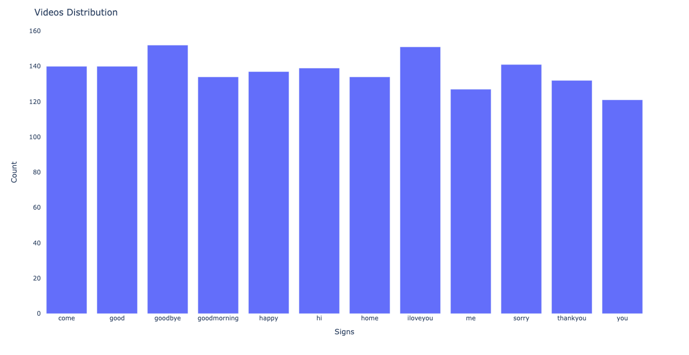
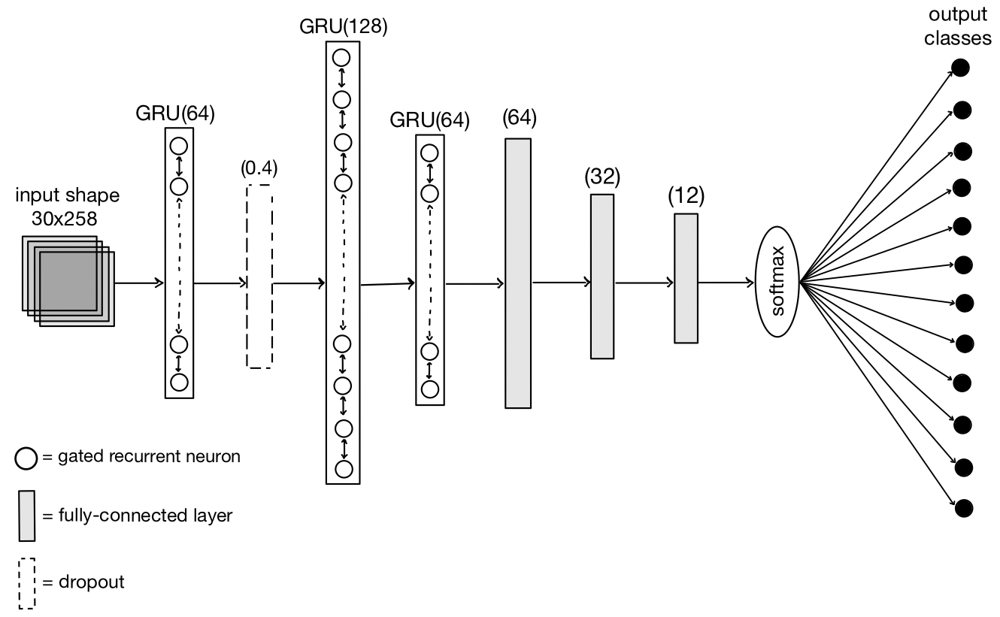
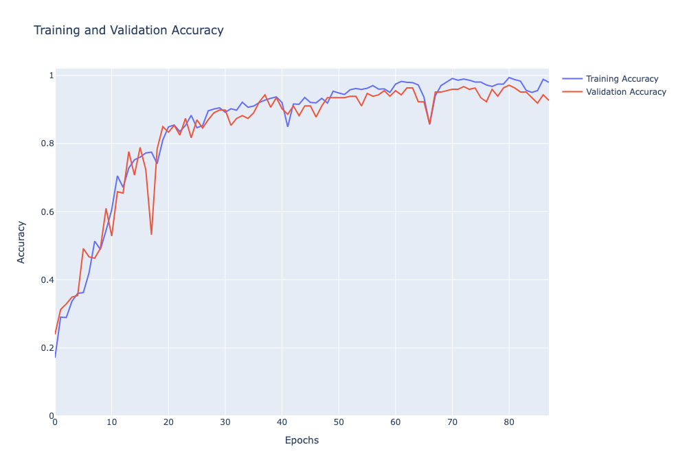
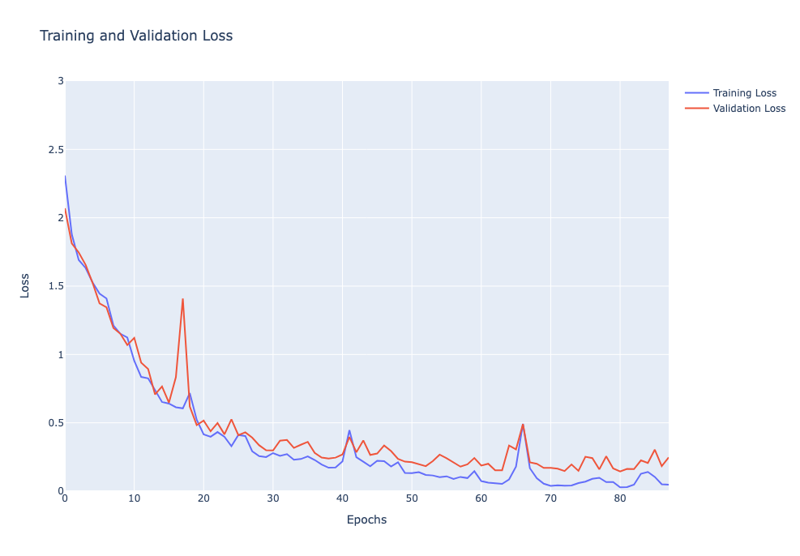
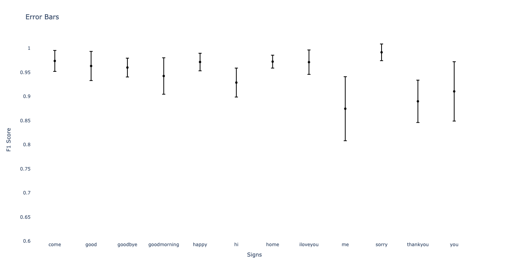
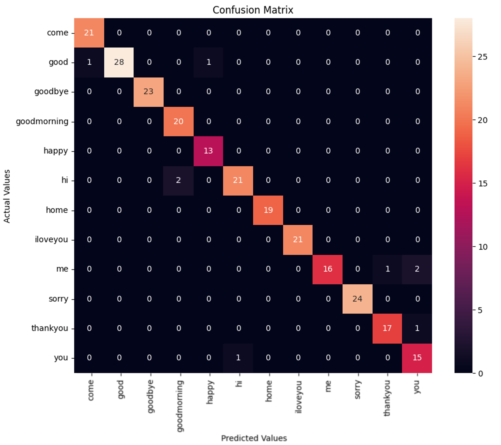

# Isolated Sign Language Recognition

## Abstract

This project aims at developing a gesture recognition system of Greek Sign Lan- guage. The proposed method employs a custom neural network trained on a dataset collected with the aid of 10 student volunteers. The objective of the proposed system is to accurately recognise and classify different gestures, attempting to bridge the communication gap between hearing and deaf individuals. In contrast to previous studies that relied on expensive or intrusive equipment, this system uses a computer vision-based approach that solely necessitates a camera, thereby enabling natural everyday interaction. The neural network was trained utilising pose and hand fea- tures extracted with Mediapipe (MP) and a stacked Gated Recurrent Unit (GRU), ultimately achieving a 96.3% accuracy rate on the final dataset. Providing a cost- effective and efficient sign language recognition tool can enhance communication and accessibility for hard-of-hearing or mute individuals and function as an educational resource for those interested in learning sign language.

### Data Collection

Collected my own GSL dataset of 12 words (7-10 volunteers for each video, 20 videos each volunteer for each word, 30 frames/video)

    ”goodbye”, ”good morning”, ”hi”, ”me”, ”thank you”, ”you”, ”come,” ”good”, ”happy”, ”home”, ”I love you”, ”sorry” 

Half one-handed signs, half two-handed signs

Variations between each recording

- Capture differences when performing the sign

### Feature Extraction

Used MediaPipe holistic pipeline

Extracted hand and skeletal landmarks (2*21 with x,y,z coordinates for the hand landmarks and 33 x,y,z, and a confidence metric for the skeletal landmarks)
*Note: z-axis is relative, not absolute*

Saved in NumPy array files

### Data Pre-processing

Unable to capture landmarks from certain frames ➞ data cleaning

- prevent incorrect identification of features

After pre-processing, a dataset containing 1648 videos was obtained

Labelled data with number labels to each of the dataset’s signs ➞ one-hot encoded

### Model Architecture

Attempted various architectures

- Gated Recurrent Unit (GRU): learning long-term dependencies in sequential data
- Dropout: prevent overfitting
- Fully-Connected Layers: network learns complex features between input vectors and the output

### Training

- Split dataset: train, validation, test
- Optimiser: Adam ➞ adapts learning rate
- Loss function: Categorical cross-entropy
- 100 epochs, with batch size of 32, terminate early if the validation loss has no improvement for a span of 7 epochs after 80 epochs of training

## Evaluation

### Error Bars

Present level of uncertainty (variance) in the model’s performance across multiple classes

Indicate the range of predicted probability for each class, providing a visual representation of the degree of certainty regarding the model’s classification performance

- small error bars - model has high confidence in its predictions for that class
- large error bars - model is less confident in its predictions for that class

### Confusion Matrix

- Depict false classifications and identify areas of concern
- Number of instances correctly or incorrectly classified for each label combination
- Each row and column of the matrix represents a label
- Each cell represents number of cases classified under each label combination
- Misclassifications of one-handed signs are with other one-handed signs, and similarly for two-handed signs ➞ complete division

